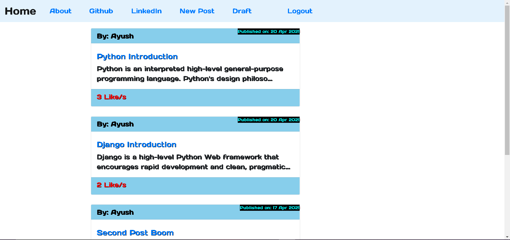
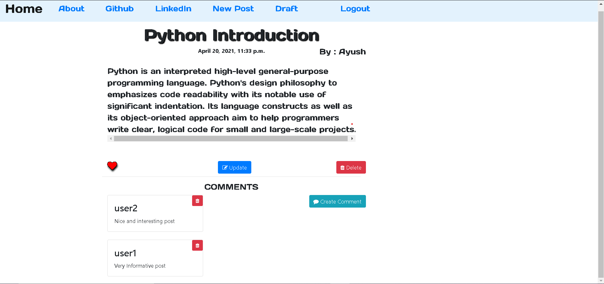
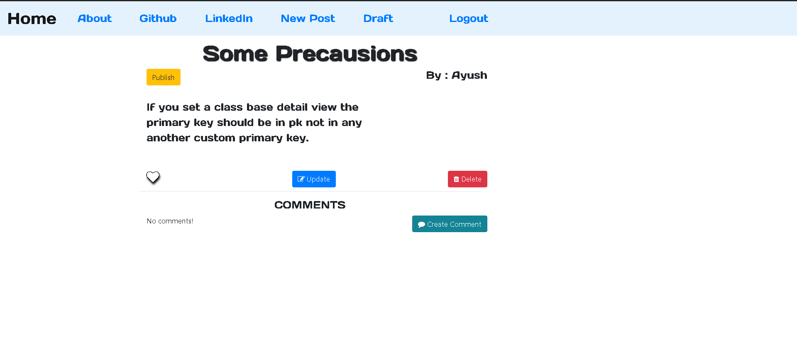
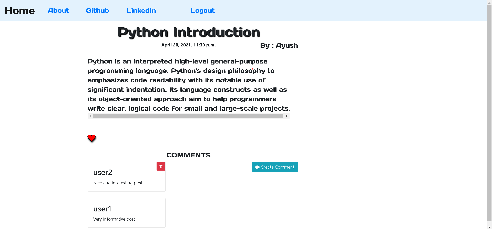
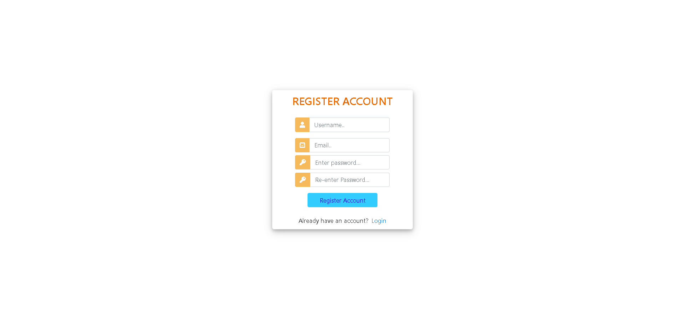
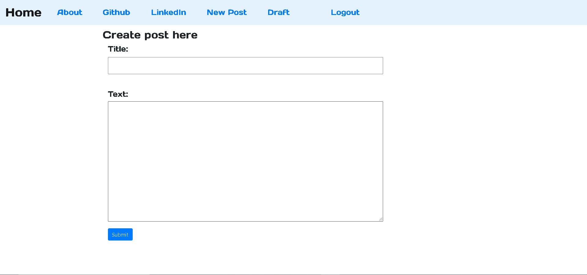
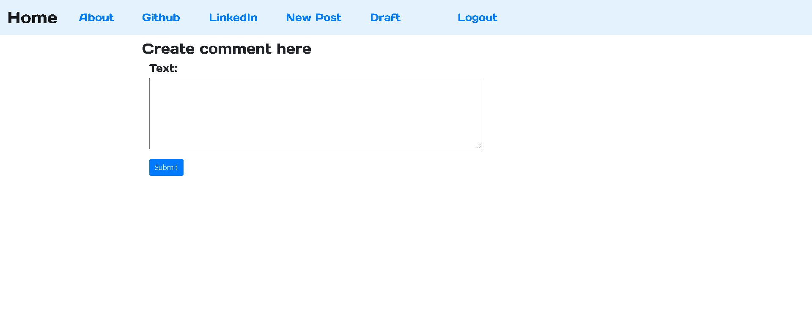

# Django Blog

Full-Featured Blog with Django web framework.

## Screenshots

 

## Features
- User Registration
- User Login & Logout
- Create, Update, View & Delete Posts
- Like post
- Create Comments
- Draft List For Unpublished Post

